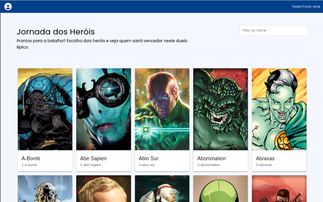
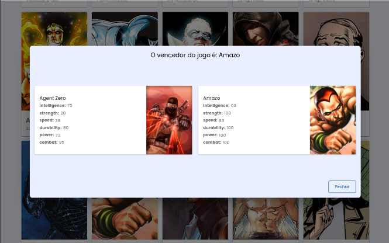

# Teste técnico - Jornada dos Heróis

## Objetivo

Desenvolvimento da interface do usuário usando React, com ênfase em consumo de API relacionada na tema dos heróis. 

### Funções

- Listagem de heróis
- Filtro de Heróis
- Sistema de combate entre Heróis

### Ferramentas utilizadas
- React.js
- Styled-components
- Material UI
- React Context
- React Icon
- React Modal
- Axios
- ESlint
- Prettier


### `Instalação`

1. Clone o repositório
```
$ git clone https://github.com/mikasampaio/teste-tecnico-herois.git
```

2. Instale as depedências
```
$ yarn add
```

3. Start o projeto
```
$  yarn start
```

### Preview



<br>



### Desenvolvido por

Mikaeli Pereira Sampaio

### Contato

mikaasampaio6@gmail.com

https://www.linkedin.com/in/mikaeli-pereira/