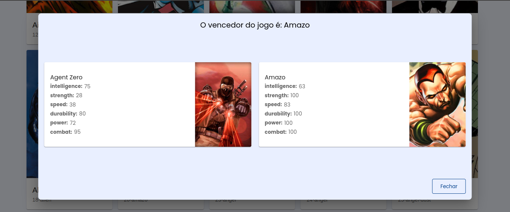

# Teste técnico - Jornada dos Heróis

### 📷 Preview


<br>



> Desenvolvimento da interface do usuário usando React, com ênfase em consumo de API relacionada na tema dos heróis.

### 🚀 Funções

- Listagem de heróis
- Filtro de Heróis
- Sistema de combate entre Heróis

### ⚙️ Ferramentas utilizadas
- React.js
- Styled-components
- Material UI
- React Context
- React Icon
- React Modal
- Axios
- ESlint
- Prettier


### 💻 `Instalação`

1. Clone o repositório
```
$ git clone https://github.com/mikasampaio/teste-tecnico-herois.git
```

2. Instale as depedências
```
$ yarn add
```

3. Start o projeto
```
$  yarn start
```

### ✒️ Desenvolvido por

Mikaeli Pereira Sampaio

### 💬 Contato

Email: mikaasampaio6@gmail.com

Linkedin: https://www.linkedin.com/in/mikaeli-pereira/